# 01_first_interresting_save : 15/04/2018

#### 15/04/2018 21h00

The agent was only doing one action (in general). But after 5000 episodes, the action distribution changed. Is it meaning that the agent is actually learning something but only changing after 5000 episodes? 

##### Action distribution

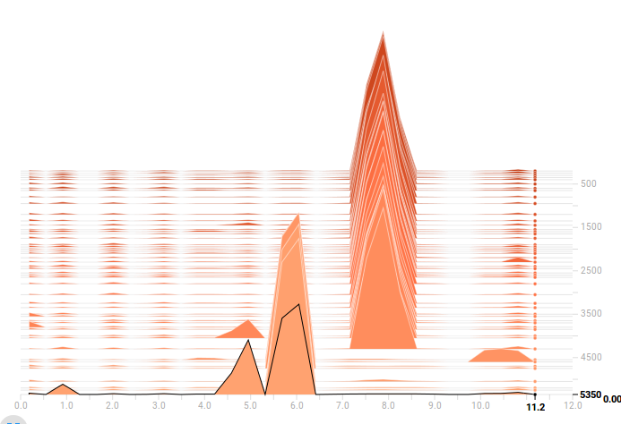:


##### Hyperparameters

```python
# create the world
world_config = {
    'ennemies' : True
}

# create the neural network that will learn to avoid ennemies
avoid_ennemy_model = Model(session, 'avoid_ennemy', State.get_ennemy_agent_layer_shape(world), 1e-2,
    [[64, 'relu'],
    [32, 'relu'],
    [Action.NB_POSSIBLE_ACTIONS, 'linear']]
)
def avoid_ennemy_input_adapter(bus, next_state=False):
    if next_state:
        return bus['next_state'].get_ennemy_agent_layer_only()
    else:
        return bus['state'].get_ennemy_agent_layer_only()
avoid_ennemy_network = Network(
    avoid_ennemy_model,
    avoid_ennemy_input_adapter,
    True,
    True
)

# create agent and his hyperparameters (config)
epsilon = Epsilon(0.05)
def update_epsilon(epsilon):
    epsilon.value = epsilon.value
epsilon.set_epsilon_function(update_epsilon)

agent_config = {}
agent_config['epsilon'] = epsilon
agent_config['networks'] = [avoid_ennemy_network]
agent_config['output_network'] = avoid_ennemy_network
agent_config['copy_target_period'] = 100
agent_config['min_experience_size'] = 1000
agent_config['max_experience_size'] = 5000
agent_config['batch_size'] = 256
agent_config['gamma'] = 0.9

agent_config['save_folder'] = SAVE_FOLDER
agent_config['save_prefix_names'] = PREFIX_FILES_NAME
```


### 18/04/2018

The agent seems to overfit because it is training too many times PER episodes! Fixed this by removing the batch used to train from the experience

*(commit eef753f  or eef753f29a08a954a404877764a190adf8b8f9ad)*

### 20/04/2018

Maybe the problem could be that the target network is copying before any training has been done? 

### 23/04/2018

- Is the agent training enough? Should plot the evolution of the Q values

  Does the plotting of the Q values have some meaning? I mean that we have so much states at stake. How would we have some valuable plot? 

- the agent has his position?? Yes (tested on branch fix/action_distribution_problem)

- is the ratio positive / negative reward too low?

#### Removing experiences

maybe the fact that removing the experiences used wasn't a good solution. The main problem was that the agent was training too much. But doesnt it overfit the sameway?  I don't think so because the experience used is removed. But still... it uses the same action... 

#### Running some new tests

I'm running some tests with a bigger network but have memory problem since I do the predict and training on the same computer. So I'm going to do a bash script that train the same agent 500 times, then close the program and rerun the agent from the last save. I will try to train the agent by this way 150000 times. 

On a second computer, I will train the agent with the same small network 150000 times just to see the differences. (if any)

#### Learning rate problem? 

But still... Maybe the fact that I'm using a learning rate of $1e-2$ with the *tf.train.GradientDescentOptimizer* will brake the tests. If so, I have to try the same tests (2 paragraphs above) and see the result. 

#### What to plot? 

###### If the plots are the same with a big and small network

Meanwhile: I should consider what plot I should add to the tensorboard: what if the plots are the sames with a big and small network? 

- if the big and small network have the same result, the problem could be on: 
     - the T-network rate copy? 
          - I should test that
     - The learning rate? Does the cost plot have a meaning when the space of actions is soo big? I thing it has some meaning since it gets smaller and smaller on the firsts episodes. **I should check its evolution when running the tests on 150'000 episodes, in correlation with the score plot**. But still... what to think 
- **random actions**: I still havent tested the plots when the agent is doing only random actions. It should give me something

#### The essential of the first experience:

Still... I saw the action distribution change **drastically** with a small network and 4000 episodes. I should consider that, event it this was overfitting. I mean: even overfitting, the action distribution changed! **I would like to reproduce this drastic action distribution change and see how the costs plot behaves**

#### What if the histogram of actions is wrong? :open_mouth:

It it worth to check...


### 24/04/2018

Runned some tests: 

##### Not random, 150'000 episodes, small network:

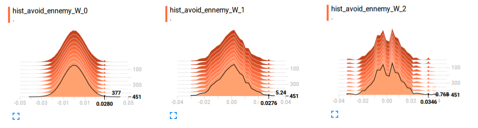

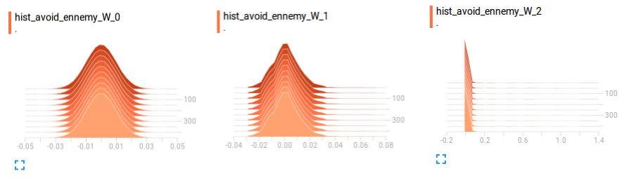

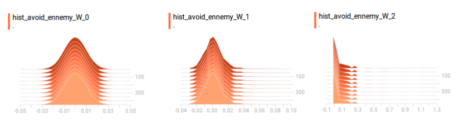

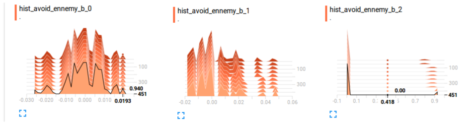

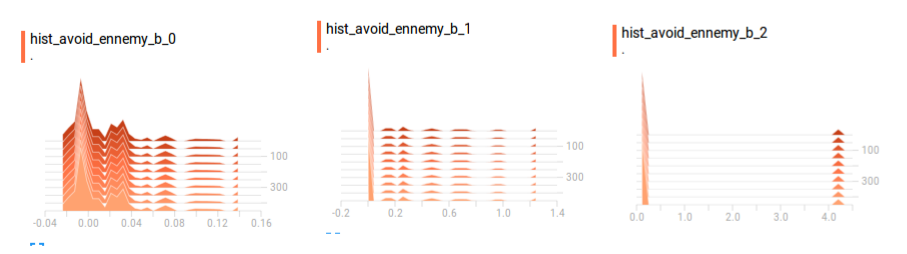

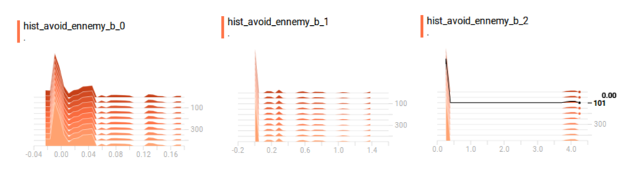

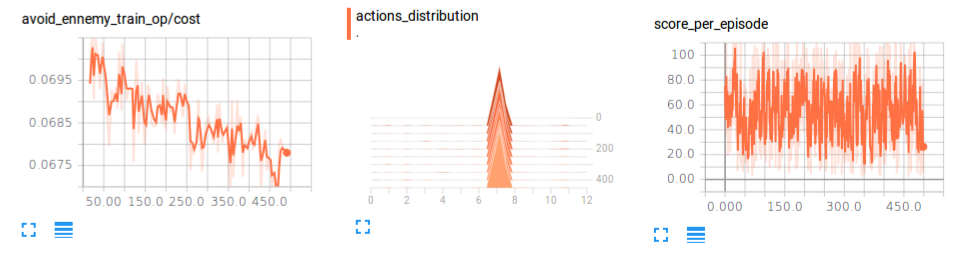

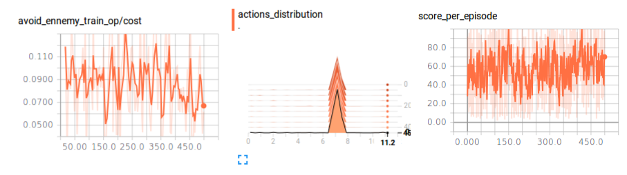

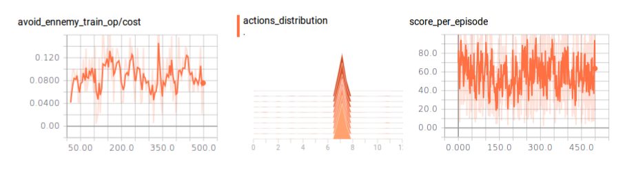

##### Random, 150'000 episodes, small network:

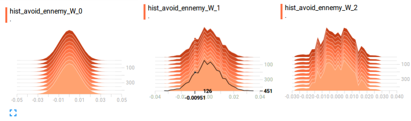

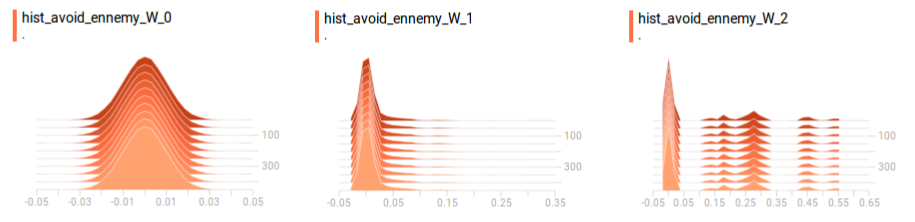

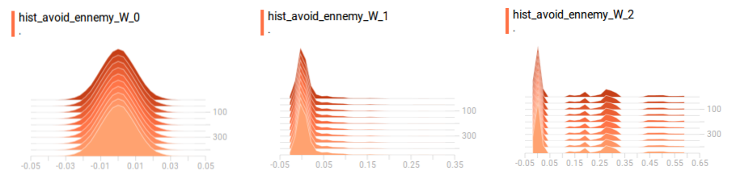

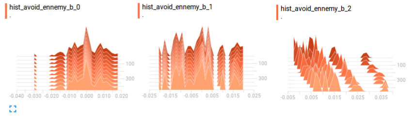

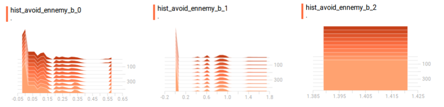


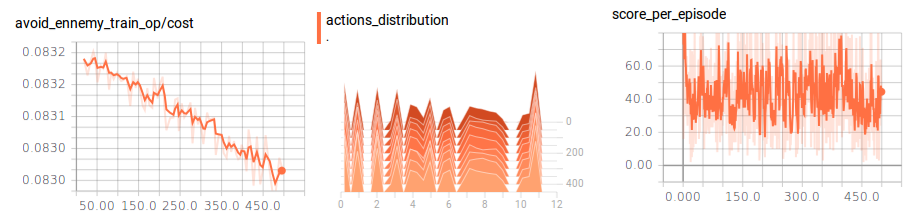

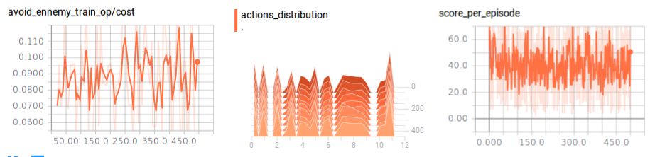

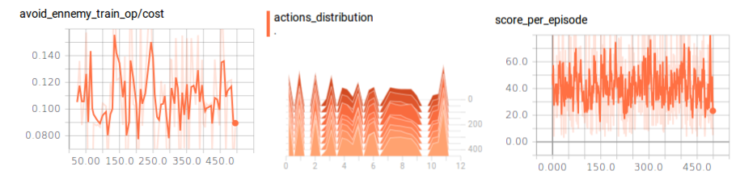

With these results, I changed the world into a tiny world with only one pursuing ennemy. It still shows the same results. 

- is the train operation wrong? It looks so no?
  - is it the gradient descent? 
  - is it the optimizer? 
  - is it the one hot encoding wrong? I doesnt think so because I had it unit tested. :-/ should I review this?  
  - is it the last layer? Why would I use a linear activation function?  

##### Problem with the learning process: 

I can see and confirm that the Q value of the same action is growing and growing, but the action of the action related to the min Q value isn't changing very much. 

###### With the gradient descent and 1e-4 we have this: 

```
score avg after 26900 episodes: 11.160000
predicted values: max: 4 -> 0.031630, min: 2 -> -0.012022
predicted values: max: 4 -> 0.031669, min: 2 -> -0.011665
predicted values: max: 4 -> 0.031818, min: 2 -> -0.011999
predicted values: max: 4 -> 0.031888, min: 2 -> -0.012139
...
score avg after 51900 episodes: 10.160000
predicted values: max: 4 -> 0.046232, min: 2 -> -0.011819
predicted values: max: 4 -> 0.046057, min: 2 -> -0.012010
predicted values: max: 4 -> 0.046357, min: 2 -> -0.012417
predicted values: max: 4 -> 0.045977, min: 2 -> -0.012322
predicted values: max: 4 -> 0.046193, min: 2 -> -0.011943
predicted values: max: 4 -> 0.046189, min: 2 -> -0.011941
predicted values: max: 4 -> 0.046202, min: 2 -> -0.011859
predicted values: max: 4 -> 0.046262, min: 2 -> -0.011964
predicted values: max: 4 -> 0.045772, min: 2 -> -0.012028
predicted values: max: 4 -> 0.046024, min: 2 -> -0.012130
predicted values: max: 4 -> 0.046124, min: 2 -> -0.012212
predicted values: max: 4 -> 0.046175, min: 2 -> -0.012094
predicted values: max: 4 -> 0.046049, min: 2 -> -0.012302
...
score avg after 63900 episodes: 11.010000
predicted values: max: 4 -> 0.052920, min: 2 -> -0.011634
predicted values: max: 4 -> 0.053089, min: 2 -> -0.011761
predicted values: max: 4 -> 0.052834, min: 2 -> -0.011909
predicted values: max: 4 -> 0.052791, min: 2 -> -0.012279
predicted values: max: 4 -> 0.052829, min: 2 -> -0.012137
predicted values: max: 4 -> 0.052673, min: 2 -> -0.012025
predicted values: max: 4 -> 0.052975, min: 2 -> -0.012139
predicted values: max: 4 -> 0.053212, min: 2 -> -0.012497
predicted values: max: 4 -> 0.052975, min: 2 -> -0.012191
predicted values: max: 4 -> 0.053045, min: 2 -> -0.012142
predicted values: max: 4 -> 0.052908, min: 2 -> -0.012046
predicted values: max: 4 -> 0.052908, min: 2 -> -0.012046
predicted values: max: 4 -> 0.053074, min: 2 -> -0.011872
predicted values: max: 4 -> 0.053074, min: 2 -> -0.011872
...
predicted values: max: 4 -> 0.073217, min: 2 -> -0.012045
predicted values: max: 4 -> 0.073254, min: 2 -> -0.011958
predicted values: max: 4 -> 0.072861, min: 2 -> -0.012007
predicted values: max: 4 -> 0.073224, min: 2 -> -0.012170
predicted values: max: 4 -> 0.073070, min: 2 -> -0.011881
predicted values: max: 4 -> 0.073116, min: 2 -> -0.011854
score avg after 99000 episodes: 10.770000
```

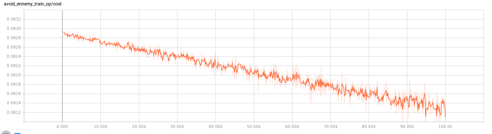

###### With the gradient descent and 1e-2 we have this: 

```
episode 0
predicted values: max: 3 -> 0.016397, min: 10 -> -0.013932
predicted values: max: 3 -> 0.016891, min: 10 -> -0.014003
predicted values: max: 3 -> 0.016418, min: 10 -> -0.013773
predicted values: max: 3 -> 0.016500, min: 10 -> -0.013903
predicted values: max: 3 -> 0.016626, min: 10 -> -0.013866
predicted values: max: 3 -> 0.016824, min: 10 -> -0.013930
predicted values: max: 3 -> 0.016465, min: 10 -> -0.013995
predicted values: max: 3 -> 0.016781, min: 10 -> -0.013882
predicted values: max: 3 -> 0.016391, min: 10 -> -0.013867
predicted values: max: 3 -> 0.016324, min: 10 -> -0.014019
predicted values: max: 3 -> 0.016448, min: 10 -> -0.013440
predicted values: max: 3 -> 0.016236, min: 10 -> -0.014212
predicted values: max: 3 -> 0.016294, min: 10 -> -0.014124
predicted values: max: 3 -> 0.016636, min: 10 -> -0.013833
predicted values: max: 3 -> 0.016636, min: 10 -> -0.013833
episode 1
...
score avg after 7900 episodes: 10.770000
predicted values: max: 3 -> 0.430787, min: 10 -> -0.010142
predicted values: max: 3 -> 0.430621, min: 10 -> -0.009941
predicted values: max: 3 -> 0.430770, min: 10 -> -0.009949
...
predicted values: max: 3 -> 2.762322, min: 10 -> 0.024099
predicted values: max: 3 -> 2.765131, min: 10 -> 0.023827
predicted values: max: 3 -> 2.763530, min: 10 -> 0.023823
predicted values: max: 3 -> 2.762971, min: 10 -> 0.024149
predicted values: max: 3 -> 2.762525, min: 10 -> 0.024096
predicted values: max: 3 -> 2.765690, min: 10 -> 0.023770
predicted values: max: 3 -> 2.762766, min: 10 -> 0.023873
predicted values: max: 3 -> 2.772389, min: 10 -> 0.024109
predicted values: max: 3 -> 2.767864, min: 10 -> 0.024025
predicted values: max: 3 -> 2.760964, min: 10 -> 0.023851
predicted values: max: 3 -> 2.764509, min: 10 -> 0.023719
predicted values: max: 3 -> 2.770816, min: 10 -> 0.023915
predicted values: max: 3 -> 2.769500, min: 10 -> 0.024126
predicted values: max: 3 -> 2.771946, min: 10 -> 0.024058
predicted values: max: 3 -> 2.760611, min: 10 -> 0.023825
score avg after 65000 episodes: 9.750000
...
score avg after 71900 episodes: 10.040000
predicted values: max: 3 -> 3.020734, min: 10 -> 0.029764
predicted values: max: 3 -> 3.019083, min: 10 -> 0.029480
predicted values: max: 3 -> 3.024070, min: 10 -> 0.029527
predicted values: max: 3 -> 3.024272, min: 10 -> 0.029541
predicted values: max: 3 -> 3.025204, min: 10 -> 0.029572
predicted values: max: 3 -> 3.023442, min: 10 -> 0.029492
predicted values: max: 3 -> 3.024769, min: 10 -> 0.029572
predicted values: max: 3 -> 3.023679, min: 10 -> 0.029509
predicted values: max: 3 -> 3.024163, min: 10 -> 0.029461
predicted values: max: 3 -> 3.023979, min: 10 -> 0.029593
predicted values: max: 3 -> 3.024036, min: 10 -> 0.029514
...
score avg after 85900 episodes: 10.200000
predicted values: max: 3 -> 3.538479, min: 10 -> 0.042640
predicted values: max: 3 -> 3.535203, min: 10 -> 0.042904
predicted values: max: 3 -> 3.541384, min: 10 -> 0.042826
predicted values: max: 3 -> 3.536927, min: 10 -> 0.042911
predicted values: max: 3 -> 3.544486, min: 10 -> 0.042874
predicted values: max: 3 -> 3.547571, min: 10 -> 0.043110
predicted values: max: 3 -> 3.544501, min: 10 -> 0.042783
predicted values: max: 3 -> 3.546052, min: 10 -> 0.043002
score avg after 86000 episodes: 9.570000
...
score avg after 98900 episodes: 9.640000
predicted values: max: 3 -> 3.999992, min: 10 -> 0.057102
predicted values: max: 3 -> 3.998166, min: 10 -> 0.057038
predicted values: max: 3 -> 3.999067, min: 10 -> 0.056980
```

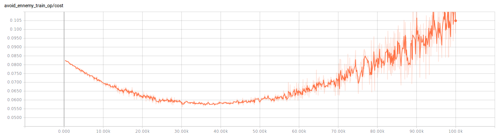

**But it seems like a to high learning rate process. What if we do a test with 1e-4 on a 1'000'000 training? I should test tomorow just to see. Meanwhile, I have to investigate why the unique action is gaining Q-value  so much.** 

##### I should also test with world's observations values between 0 and 1 AND NOT bewteen -0.5, 0.5!!!

##### reward: 

- should I try a reward like: objective == 1000 steps: so a reward is 1000/nb_steps ? 


### 25/04/2018

I could change the action distribution by changing the reward function! I think the main problem was that the reward was too high and there wasnt any negative reward when the agent was hit. So when the agent was doing the same action every time, it got a good reward. 

I used this reward function

```python
if self.game_over:
    reward = -10
else:
    max_distance = 10
    security_distance = 5
    smallest_distance_ennemy_collision_course = float('Inf')
    for ennemy in self.ennemies:
        if Direction.is_in_collision_course(ennemy, self.agent, security_distance):
            distance = Direction.distance(ennemy, self.agent)
            if distance < smallest_distance_ennemy_collision_course:
                smallest_distance_ennemy_collision_course = distance
    if smallest_distance_ennemy_collision_course >= max_distance:
        reward = 1
    else:
        reward = (smallest_distance_ennemy_collision_course/max_distance) ** 0.4
```


**I now have to export the reward function in order to define it on the main so I could have the reward function used on the saves files**

