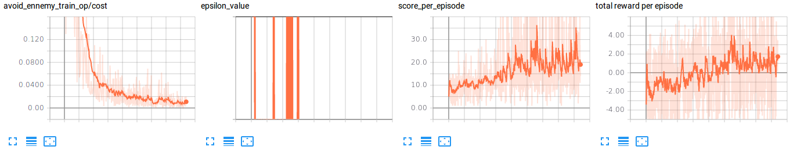

# 01_first_interresting_save : 15/04/2018

#### 15/04/2018 21h00

The agent was only doing one action (in general). But after 5000 episodes, the action distribution changed. Is it meaning that the agent is actually learning something but only changing after 5000 episodes? 

##### Action distribution

:


##### Hyperparameters

```python
# create the world
world_config = {
    'ennemies' : True
}

# create the neural network that will learn to avoid ennemies
avoid_ennemy_model = Model(session, 'avoid_ennemy', State.get_ennemy_agent_layer_shape(world), 1e-2,
    [[64, 'relu'],
    [32, 'relu'],
    [Action.NB_POSSIBLE_ACTIONS, 'linear']]
)
def avoid_ennemy_input_adapter(bus, next_state=False):
    if next_state:
        return bus['next_state'].get_ennemy_agent_layer_only()
    else:
        return bus['state'].get_ennemy_agent_layer_only()
avoid_ennemy_network = Network(
    avoid_ennemy_model,
    avoid_ennemy_input_adapter,
    True,
    True
)

# create agent and his hyperparameters (config)
epsilon = Epsilon(0.05)
def update_epsilon(epsilon):
    epsilon.value = epsilon.value
epsilon.set_epsilon_function(update_epsilon)

agent_config = {}
agent_config['epsilon'] = epsilon
agent_config['networks'] = [avoid_ennemy_network]
agent_config['output_network'] = avoid_ennemy_network
agent_config['copy_target_period'] = 100
agent_config['min_experience_size'] = 1000
agent_config['max_experience_size'] = 5000
agent_config['batch_size'] = 256
agent_config['gamma'] = 0.9

agent_config['save_folder'] = SAVE_FOLDER
agent_config['save_prefix_names'] = PREFIX_FILES_NAME
```


### 18/04/2018

The agent seems to overfit because it is training too many times PER episodes! Fixed this by removing the batch used to train from the experience

*(commit eef753f  or eef753f29a08a954a404877764a190adf8b8f9ad)*

### 20/04/2018

Maybe the problem could be that the target network is copying before any training has been done? 

### 23/04/2018

- Is the agent training enough? Should plot the evolution of the Q values

  Does the plotting of the Q values have some meaning? I mean that we have so much states at stake. How would we have some valuable plot? 

- the agent has his position?? Yes (tested on branch fix/action_distribution_problem)

- is the ratio positive / negative reward too low?

#### Removing experiences

maybe the fact that removing the experiences used wasn't a good solution. The main problem was that the agent was training too much. But doesnt it overfit the sameway?  I don't think so because the experience used is removed. But still... it uses the same action... 

#### Running some new tests

I'm running some tests with a bigger network but have memory problem since I do the predict and training on the same computer. So I'm going to do a bash script that train the same agent 500 times, then close the program and rerun the agent from the last save. I will try to train the agent by this way 150000 times. 

On a second computer, I will train the agent with the same small network 150000 times just to see the differences. (if any)

#### Learning rate problem? 

But still... Maybe the fact that I'm using a learning rate of $1e-2$ with the *tf.train.GradientDescentOptimizer* will brake the tests. If so, I have to try the same tests (2 paragraphs above) and see the result. 

#### What to plot? 

###### If the plots are the same with a big and small network

Meanwhile: I should consider what plot I should add to the tensorboard: what if the plots are the sames with a big and small network? 

- if the big and small network have the same result, the problem could be on: 
     - the T-network rate copy? 
          - I should test that
     - The learning rate? Does the cost plot have a meaning when the space of actions is soo big? I thing it has some meaning since it gets smaller and smaller on the firsts episodes. **I should check its evolution when running the tests on 150'000 episodes, in correlation with the score plot**. But still... what to think 
- **random actions**: I still havent tested the plots when the agent is doing only random actions. It should give me something

#### The essential of the first experience:

Still... I saw the action distribution change **drastically** with a small network and 4000 episodes. I should consider that, event it this was overfitting. I mean: even overfitting, the action distribution changed! **I would like to reproduce this drastic action distribution change and see how the costs plot behaves**

#### What if the histogram of actions is wrong? :open_mouth:

It it worth to check...


### 24/04/2018

Runned some tests: 

##### Not random, 150'000 episodes, small network:


##### Random, 150'000 episodes, small network:


With these results, I changed the world into a tiny world with only one pursuing ennemy. It still shows the same results. 

- is the train operation wrong? It looks so no?
  - is it the gradient descent? 
  - is it the optimizer? 
  - is it the one hot encoding wrong? I doesnt think so because I had it unit tested. :-/ should I review this?  
  - is it the last layer? Why would I use a linear activation function?  

##### Problem with the learning process: 

I can see and confirm that the Q value of the same action is growing and growing, but the action of the action related to the min Q value isn't changing very much. 

###### With the gradient descent and 1e-4 we have this: 

```
score avg after 26900 episodes: 11.160000
predicted values: max: 4 -> 0.031630, min: 2 -> -0.012022
predicted values: max: 4 -> 0.031669, min: 2 -> -0.011665
predicted values: max: 4 -> 0.031818, min: 2 -> -0.011999
predicted values: max: 4 -> 0.031888, min: 2 -> -0.012139
...
score avg after 51900 episodes: 10.160000
predicted values: max: 4 -> 0.046232, min: 2 -> -0.011819
predicted values: max: 4 -> 0.046057, min: 2 -> -0.012010
predicted values: max: 4 -> 0.046357, min: 2 -> -0.012417
predicted values: max: 4 -> 0.045977, min: 2 -> -0.012322
predicted values: max: 4 -> 0.046193, min: 2 -> -0.011943
predicted values: max: 4 -> 0.046189, min: 2 -> -0.011941
predicted values: max: 4 -> 0.046202, min: 2 -> -0.011859
predicted values: max: 4 -> 0.046262, min: 2 -> -0.011964
predicted values: max: 4 -> 0.045772, min: 2 -> -0.012028
predicted values: max: 4 -> 0.046024, min: 2 -> -0.012130
predicted values: max: 4 -> 0.046124, min: 2 -> -0.012212
predicted values: max: 4 -> 0.046175, min: 2 -> -0.012094
predicted values: max: 4 -> 0.046049, min: 2 -> -0.012302
...
score avg after 63900 episodes: 11.010000
predicted values: max: 4 -> 0.052920, min: 2 -> -0.011634
predicted values: max: 4 -> 0.053089, min: 2 -> -0.011761
predicted values: max: 4 -> 0.052834, min: 2 -> -0.011909
predicted values: max: 4 -> 0.052791, min: 2 -> -0.012279
predicted values: max: 4 -> 0.052829, min: 2 -> -0.012137
predicted values: max: 4 -> 0.052673, min: 2 -> -0.012025
predicted values: max: 4 -> 0.052975, min: 2 -> -0.012139
predicted values: max: 4 -> 0.053212, min: 2 -> -0.012497
predicted values: max: 4 -> 0.052975, min: 2 -> -0.012191
predicted values: max: 4 -> 0.053045, min: 2 -> -0.012142
predicted values: max: 4 -> 0.052908, min: 2 -> -0.012046
predicted values: max: 4 -> 0.052908, min: 2 -> -0.012046
predicted values: max: 4 -> 0.053074, min: 2 -> -0.011872
predicted values: max: 4 -> 0.053074, min: 2 -> -0.011872
...
predicted values: max: 4 -> 0.073217, min: 2 -> -0.012045
predicted values: max: 4 -> 0.073254, min: 2 -> -0.011958
predicted values: max: 4 -> 0.072861, min: 2 -> -0.012007
predicted values: max: 4 -> 0.073224, min: 2 -> -0.012170
predicted values: max: 4 -> 0.073070, min: 2 -> -0.011881
predicted values: max: 4 -> 0.073116, min: 2 -> -0.011854
score avg after 99000 episodes: 10.770000
```


###### With the gradient descent and 1e-2 we have this: 

```
episode 0
predicted values: max: 3 -> 0.016397, min: 10 -> -0.013932
predicted values: max: 3 -> 0.016891, min: 10 -> -0.014003
predicted values: max: 3 -> 0.016418, min: 10 -> -0.013773
predicted values: max: 3 -> 0.016500, min: 10 -> -0.013903
predicted values: max: 3 -> 0.016626, min: 10 -> -0.013866
predicted values: max: 3 -> 0.016824, min: 10 -> -0.013930
predicted values: max: 3 -> 0.016465, min: 10 -> -0.013995
predicted values: max: 3 -> 0.016781, min: 10 -> -0.013882
predicted values: max: 3 -> 0.016391, min: 10 -> -0.013867
predicted values: max: 3 -> 0.016324, min: 10 -> -0.014019
predicted values: max: 3 -> 0.016448, min: 10 -> -0.013440
predicted values: max: 3 -> 0.016236, min: 10 -> -0.014212
predicted values: max: 3 -> 0.016294, min: 10 -> -0.014124
predicted values: max: 3 -> 0.016636, min: 10 -> -0.013833
predicted values: max: 3 -> 0.016636, min: 10 -> -0.013833
episode 1
...
score avg after 7900 episodes: 10.770000
predicted values: max: 3 -> 0.430787, min: 10 -> -0.010142
predicted values: max: 3 -> 0.430621, min: 10 -> -0.009941
predicted values: max: 3 -> 0.430770, min: 10 -> -0.009949
...
predicted values: max: 3 -> 2.762322, min: 10 -> 0.024099
predicted values: max: 3 -> 2.765131, min: 10 -> 0.023827
predicted values: max: 3 -> 2.763530, min: 10 -> 0.023823
predicted values: max: 3 -> 2.762971, min: 10 -> 0.024149
predicted values: max: 3 -> 2.762525, min: 10 -> 0.024096
predicted values: max: 3 -> 2.765690, min: 10 -> 0.023770
predicted values: max: 3 -> 2.762766, min: 10 -> 0.023873
predicted values: max: 3 -> 2.772389, min: 10 -> 0.024109
predicted values: max: 3 -> 2.767864, min: 10 -> 0.024025
predicted values: max: 3 -> 2.760964, min: 10 -> 0.023851
predicted values: max: 3 -> 2.764509, min: 10 -> 0.023719
predicted values: max: 3 -> 2.770816, min: 10 -> 0.023915
predicted values: max: 3 -> 2.769500, min: 10 -> 0.024126
predicted values: max: 3 -> 2.771946, min: 10 -> 0.024058
predicted values: max: 3 -> 2.760611, min: 10 -> 0.023825
score avg after 65000 episodes: 9.750000
...
score avg after 71900 episodes: 10.040000
predicted values: max: 3 -> 3.020734, min: 10 -> 0.029764
predicted values: max: 3 -> 3.019083, min: 10 -> 0.029480
predicted values: max: 3 -> 3.024070, min: 10 -> 0.029527
predicted values: max: 3 -> 3.024272, min: 10 -> 0.029541
predicted values: max: 3 -> 3.025204, min: 10 -> 0.029572
predicted values: max: 3 -> 3.023442, min: 10 -> 0.029492
predicted values: max: 3 -> 3.024769, min: 10 -> 0.029572
predicted values: max: 3 -> 3.023679, min: 10 -> 0.029509
predicted values: max: 3 -> 3.024163, min: 10 -> 0.029461
predicted values: max: 3 -> 3.023979, min: 10 -> 0.029593
predicted values: max: 3 -> 3.024036, min: 10 -> 0.029514
...
score avg after 85900 episodes: 10.200000
predicted values: max: 3 -> 3.538479, min: 10 -> 0.042640
predicted values: max: 3 -> 3.535203, min: 10 -> 0.042904
predicted values: max: 3 -> 3.541384, min: 10 -> 0.042826
predicted values: max: 3 -> 3.536927, min: 10 -> 0.042911
predicted values: max: 3 -> 3.544486, min: 10 -> 0.042874
predicted values: max: 3 -> 3.547571, min: 10 -> 0.043110
predicted values: max: 3 -> 3.544501, min: 10 -> 0.042783
predicted values: max: 3 -> 3.546052, min: 10 -> 0.043002
score avg after 86000 episodes: 9.570000
...
score avg after 98900 episodes: 9.640000
predicted values: max: 3 -> 3.999992, min: 10 -> 0.057102
predicted values: max: 3 -> 3.998166, min: 10 -> 0.057038
predicted values: max: 3 -> 3.999067, min: 10 -> 0.056980
```


**But it seems like a to high learning rate process. What if we do a test with 1e-4 on a 1'000'000 training? I should test tomorow just to see. Meanwhile, I have to investigate why the unique action is gaining Q-value  so much.** 

##### I should also test with world's observations values between 0 and 1 AND NOT bewteen -0.5, 0.5!!!

##### reward: 

- should I try a reward like: objective == 1000 steps: so a reward is 1000/nb_steps ? 


### 25/04/2018

I could change the action distribution by changing the reward function! I think the main problem was that the reward was too high and there wasnt any negative reward when the agent was hit. So when the agent was doing the same action every time, it got a good reward. 

I used this reward function

```python
if self.game_over:
    reward = -10
else:
    max_distance = 10
    security_distance = 5
    smallest_distance_ennemy_collision_course = float('Inf')
    for ennemy in self.ennemies:
        if Direction.is_in_collision_course(ennemy, self.agent, security_distance):
            distance = Direction.distance(ennemy, self.agent)
            if distance < smallest_distance_ennemy_collision_course:
                smallest_distance_ennemy_collision_course = distance
    if smallest_distance_ennemy_collision_course >= max_distance:
        reward = 1
    else:
        reward = (smallest_distance_ennemy_collision_course/max_distance) ** 0.4
```


**I now have to export the reward function in order to define it on the main so I could have the reward function used on the saves files**


### 26/04/2018

##### reward_test_5

The action distribution is changing, but the weights arent changing much. I tried another activation function but still doesnt work. 

I think it is because I'm using an input with too much 0. I shouldn't have some 0 in my input. I changed the input and the weights became to change. But the action distribution became likewise (unique). But its value isnt upgrading but downgrading. So it should not stay like this very much:. But still... the problem isnt changing. 

```
Ennemy.x=5, Ennemy.y=9, Ennemy.direction=E, agent.x=9, agent.y=9, action=2 Reward: 0.525
predicted values: max: 2 -> -0.314418, min: 6 -> -1.045425
Ennemy.x=6, Ennemy.y=9, Ennemy.direction=E, agent.x=9, agent.y=9, action=2 Reward: 0.468
predicted values: max: 2 -> -0.314418, min: 6 -> -1.045425
Ennemy.x=6, Ennemy.y=9, Ennemy.direction=E, agent.x=9, agent.y=9, action=2 Reward: -5.00
score avg after 120000 episodes: 7.770000
...
Ennemy.x=7, Ennemy.y=4, Ennemy.direction=NE, agent.x=9, agent.y=9, action=2 Reward: 0.67
predicted values: max: 2 -> -0.285924, min: 6 -> -1.347364
Ennemy.x=7, Ennemy.y=4, Ennemy.direction=NE, agent.x=9, agent.y=9, action=2 Reward: 0.62
predicted values: max: 2 -> -0.283944, min: 6 -> -1.345910
...
predicted values: max: 2 -> -0.311123, min: 6 -> -1.526520
Ennemy.x=2, Ennemy.y=5, Ennemy.direction=SE, agent.x=3, agent.y=3, action=2 Reward: -5.000000
score avg after 200000 episodes: 7.744600
```


**maybe the problem is the number of useless outputs? ** 

**I see that when the action distribution is dropping to just one action, it seems that the values of other actions  are also changing... why?**

**I should also start testing with a learning rate of 1e-4**


#### 07/05/2018

After a week of tests, I could have at best an avg score of 20 when I ran for about 5 million episodes.  I used theses values: 

```python
def reward_function(world):
    if world.game_over:
        return - 5
    else:
        safe_distance = 6
        min_distance = float('inf')
        for ennemy in world.ennemies:
            distance = Direction.distance(ennemy, world.agent)
            if distance < min_distance:
                min_distance = distance

        if min_distance >= safe_distance:
            return 1
        elif min_distance <= 1:
            return -1
        else:
            return math.log(min_distance+0.01) -1
# create the neural network that will learn to avoid ennemies
avoid_ennemy_model = Model(session, 'avoid_ennemy', State.get_ennemy_agent_layer_shape(world), 1e-2,
        [[40, 'relu'],
         [40, 'relu'],
        [Action.NB_POSSIBLE_MOVE_ACTION, 'linear']]
)
# avoid_ennemy_model = ImportModel(session, Global.SAVE_FOLDER, 'avoid_ennemy')
def avoid_ennemy_input_adapter(bus, next_state=False):
    if next_state:
        return bus['next_state'].get_ennemy_agent_layer_only()
    else:
        return bus['state'].get_ennemy_agent_layer_only()
avoid_ennemy_network = Network(
    avoid_ennemy_model,
    avoid_ennemy_input_adapter,
    True,
    True
)

# create agent and his hyperparameters (config)
epsilon = Epsilon(0.1)
def update_epsilon(epsilon):
    epsilon.value = epsilon.value
epsilon.set_epsilon_function(update_epsilon)

agent_config = {}
agent_config['epsilon'] = epsilon
agent_config['networks'] = [avoid_ennemy_network]
agent_config['output_network'] = avoid_ennemy_network
agent_config['copy_target_period'] = 10000
agent_config['min_experience_size'] = 50000
agent_config['max_experience_size'] = 400000
agent_config['batch_size'] = 32
agent_config['gamma'] = 0.5
```


The other best save could nearly do the same in 20M episodes. 

```python
def reward_function(world):
    if world.game_over:
        return - 5
    else:
        safe_distance = 6
        min_distance = float('inf')
        for ennemy in world.ennemies:
            distance = Direction.distance(ennemy, world.agent)
            if distance < min_distance:
                min_distance = distance

        if min_distance >= safe_distance:
            return 1
        elif min_distance <= 1:
            return -1
        else:
            return math.log(min_distance+0.01) -1
# avoid_ennemy_model = Model(session, 'avoid_ennemy', State.get_ennemy_agent_layer_shape(world), 1e-3,
#         [[40, 'relu'],
#          [40, 'relu'],
#         [Action.NB_POSSIBLE_MOVE_ACTION, 'linear']]
# )
avoid_ennemy_model = ImportModel(session, Global.SAVE_FOLDER, 'avoid_ennemy')
def avoid_ennemy_input_adapter(bus, next_state=False):
    if next_state:
        return bus['next_state'].get_ennemy_agent_layer_only()
    else:
        return bus['state'].get_ennemy_agent_layer_only()
avoid_ennemy_network = Network(
    avoid_ennemy_model,
    avoid_ennemy_input_adapter,
    True,
    True
)

# create agent and his hyperparameters (config)
epsilon = Epsilon(0.1)
def update_epsilon(epsilon):
    epsilon.value = epsilon.value
epsilon.set_epsilon_function(update_epsilon)

agent_config = {}
agent_config['epsilon'] = epsilon
agent_config['networks'] = [avoid_ennemy_network]
agent_config['output_network'] = avoid_ennemy_network
agent_config['copy_target_period'] = 10000
agent_config['min_experience_size'] = 50000
agent_config['max_experience_size'] = 400000
agent_config['batch_size'] = 32
agent_config['gamma'] = 0.5
```


The main change was the copy_target_period, experiences size and batch size values. I think I was copying the target network too fast. 

- My debug's tensorflow is not scaled for 15M episodes. I should change it to choose the frequency with adding possibility allowing me to choose the frequency.  *EDIT: it seems that tensorboard is able to plot 5M points. It just takes some time to plot it all! This is good to know. However, I should should still change the frequency in order to alleviate the tensorboard files. (so I could put it on github)*
- **another thing: The toy world is hard. I can't do a big score. (I get crushed so many times! ) I have to change the toy world in order to make it easyier for me and the agent!**
- **I shoud make the batch size bigger. So I have to adapt the copy_target_period in consequence. I hope it will make the learning faster**


### 08/05/2018

I could reproduce the test of the last week and having a best avg score of 20 with these params: 

```python
# create the world
def reward_function(world):
    if world.game_over:
        return - 5
    else:
        safe_distance = 7
        min_distance = float('inf')
        for ennemy in world.ennemies:
            distance = Direction.distance(ennemy, world.agent)
            if distance < min_distance:
                min_distance = distance

        if min_distance >= safe_distance:
            return 1
        elif min_distance <= 1:
            return -1
        else:
            return math.log(min_distance+0.01) -1
          
epsilon = Epsilon(0.1)
def update_epsilon(epsilon):
    epsilon.value = epsilon.value
epsilon.set_epsilon_function(update_epsilon)

agent_config = {}
agent_config['epsilon'] = epsilon
agent_config['networks'] = [avoid_ennemy_network]
agent_config['output_network'] = avoid_ennemy_network
agent_config['copy_target_period'] = 10000
agent_config['min_experience_size'] = 50000
agent_config['max_experience_size'] = 400000
agent_config['batch_size'] = 32
agent_config['gamma'] = 0.5
```




### 08/05/2018 : 2

I wrote a script in order to see what the agent learned. The script let me see the agent in action and it turns out that the agent could learn something!  \o/


It gives me some idea on the reward I should use when the agent is cornered. Maybe I can improve the learning in that specific situation? 

To create the gif: 

https://askubuntu.com/questions/107726/how-to-create-animated-gif-images-of-a-screencast/107735#107735

```bash
recordmydesktop --width 200 --height 200 -o ~/Bureau/test.ogv
mplayer -ao null ~/Bureau/test.ogv  -vo jpeg:outdir=~/Bureau/test_gif
convert ~/Bureau/test_gif/* test.gif
```

### 19/05/2018

I'm sill waiting for the agents to finish the training on a "real" environnement. I added a tool to know the proportion of time used by the traning phase vs non traning phase. It turns out that the training phase takes like 60% of the time. 

```python
avoid_ennemy_model = Model(session, 'avoid_ennemy', State.get_ennemy_agent_layer_shape(world), 1e-2,
        [[40, 'relu'],
         [40, 'relu'],
        [Action.NB_POSSIBLE_MOVE_ACTION, 'linear']]
)
agent_config['copy_target_period'] = 10000
agent_config['min_experience_size'] = 50000
agent_config['max_experience_size'] = 400000
agent_config['batch_size'] = 32
agent_config['gamma'] = 0.5
```

)

With another ratio, I have this: 

```python
avoid_ennemy_model = Model(session, 'avoid_ennemy', State.get_ennemy_agent_layer_shape(world), 1e-2,
        [[40, 'relu'],
         [40, 'relu'],
        [Action.NB_POSSIBLE_MOVE_ACTION, 'linear']]
)
agent_config['copy_target_period'] = 10000*100
agent_config['min_experience_size'] = 50000*100
agent_config['max_experience_size'] = 400000*100
agent_config['batch_size'] = 32*100
agent_config['gamma'] = 0.5
```


It made 500'000 episodes in 9 hours with 4 Go of memory. Does it mean that it could make 5M episodes in 90 hours? For the moment, the 32 batch size is making ~312 hours, with 8 Go of memory.  The memory seems to be the biggest problem with a big batch size. 

I should try the PPO agorithm which seems promising. 

Another thing I could try is do the learning only at the end of an episode. 


### 22/05/2018

Here is the result of the series_2: 

```python
def reward_function(world):
    if world.game_over:
        return - 5
    else:
        safe_distance = 7
        min_distance = float('inf')
        for ennemy in world.ennemies:
            distance = Direction.distance(ennemy, world.agent)
            if distance < min_distance:
                min_distance = distance

        if min_distance >= safe_distance:
            return 1
        elif min_distance <= 1:
            return -1
        else:
            return math.log(min_distance+0.01) -1
world_config = {
    'ennemies' : True,
    'print_reward' : False,
    'reward_function': reward_function
}

avoid_ennemy_model = Model(session, 'avoid_ennemy', State.get_ennemy_agent_layer_shape(world), 1e-2,
        [[40, 'relu'],
         [40, 'relu'],
        [Action.NB_POSSIBLE_MOVE_ACTION, 'linear']]
)

agent_config = {}
agent_config['epsilon'] = epsilon
agent_config['networks'] = [avoid_ennemy_network]
agent_config['output_network'] = avoid_ennemy_network
agent_config['copy_target_period'] = 10000
agent_config['min_experience_size'] = 50000
agent_config['max_experience_size'] = 400000
agent_config['batch_size'] = 32
agent_config['gamma'] = 0.5
```


I'm trying to reuse this agent and continue the learning with: 

- a reward function with a safe_distance of 11 instead of 7
- a $\gamma$ of 0.7
- an $\epsilon$ of 0.05 instead of 0.1


Maybe I should also try another model with: 

- a softmax or tanh activation function for the last layer instead of a linear function! (it could avoid results being to big to correct). 
- keeping only the 50 best experiences? 


### 24/05/2018

Using bigger batches seems having broke the learning process. Maybe I broke the target copy ratio? 

Using the rates that contributed to a good learning process: 

```python
# create agent and his hyperparameters (config)
epsilon = Epsilon(0.1)
def update_epsilon(epsilon):
    epsilon.value = epsilon.value
epsilon.set_epsilon_function(update_epsilon)

agent_config = {}
agent_config['epsilon'] = epsilon
agent_config['networks'] = [avoid_ennemy_network]
agent_config['output_network'] = avoid_ennemy_network
agent_config['copy_target_period'] = 10000
agent_config['min_experience_size'] = 50000
agent_config['max_experience_size'] = 400000
agent_config['batch_size'] = 32 
agent_config['gamma'] = 0.9
```

I have this: 

```
Started training...
Target network copied after having trained 0 steps
Target network copied after having trained 0 steps
Target network copied after having trained 0 steps
Target network copied after having trained 0 steps
Target network copied after having trained 0 steps
Target network copied after having trained 32 steps
Target network copied after having trained 9984 steps
Target network copied after having trained 10016 steps
episode 2500
Target network copied after having trained 9984 steps
Target network copied after having trained 10016 steps
Target network copied after having trained 9984 steps
Target network copied after having trained 10016 steps
Target network copied after having trained 9984 steps
Target network copied after having trained 10016 steps
Target network copied after having trained 9984 steps
Target network copied after having trained 10016 steps
```

Using this: 

```python
# create agent and his hyperparameters (config)
epsilon = Epsilon(0.1)
def update_epsilon(epsilon):
    epsilon.value = epsilon.value
epsilon.set_epsilon_function(update_epsilon)

agent_config = {}
agent_config['epsilon'] = epsilon
agent_config['networks'] = [avoid_ennemy_network]
agent_config['output_network'] = avoid_ennemy_network
agent_config['copy_target_period'] = 10000 *100
agent_config['min_experience_size'] = 50000 *100
agent_config['max_experience_size'] = 400000 *100
agent_config['batch_size'] = 32 *100
agent_config['gamma'] = 0.9
```

I have: 

```
episode 175000
score avg after 175000 episodes: 21.813400
episode 177500
episode 180000
score avg after 180000 episodes: 21.860000
Target network copied after having trained 0 steps
...
episode 215000
score avg after 215000 episodes: 21.673000
episode 217500
episode 220000
score avg after 220000 episodes: 22.312400
episode 222500
episode 225000
score avg after 225000 episodes: 21.811000
Target network copied after having trained 3200 steps
...
score avg after 265000 episodes: 21.465200
episode 267500
episode 270000
score avg after 270000 episodes: 22.083400
Target network copied after having trained 998400 steps
...
episode 267500
episode 270000
score avg after 270000 episodes: 22.083400
Target network copied after having trained 998400 steps
```

It seems obvious that the learning would work. I shouldn't change the copy target period when making the batch bigger. 

### 27/05/2018

Still, the learning process seems to have broke when using bigger batches. Maybe its because that when using smaller batches, we train more often, so we ajust weights quicklier. (if we have bad weights and we wait 1000 steps to ajust then, we will overfit the NN with the 1000 bad steps. )


### 01/06/2018

I found that using the 3 last states as input increase dramatically the learning process's rate. To have a mean score of 180, it takes now 5 days instead of 14 days! 

**TODO: insert graphs here!** 

###### Training agent to fetch an object:

I've added the "food" feature to the world and trying now to teach the agent to fetch an object in the world. It should be simple but I'm facing the same problem described at the very begining of this file:  the agent is using only one action and reinforcing this action as it's Q Value is increasing "indefinetly?". 

This problem seems related to the reward function: the problem is that I try to promote the learning process by rewarding the agent to do the right thing, but *I don't penalize enough* when it doesnt do as good as I want.

Maybe the key is to find a reward as: 
$$
\begin{eqnarray}
\sum(\text{reward good behavior}) \in [0,1]  \\
\sum\gamma^{n-x}r_{-x}+\gamma^{n-x+1}r_{s-x+1}+...+\gamma^{n-1}r_{-1}+\gamma r \in [0,1]
\end{eqnarray}
$$
It seems a bit to complicated. I see at this moment: 

```
score avg after 184500 episodes: 100.444000
episode 185000
predicted values: max: 0 -> 3.413983, min: 2 -> 3.185398
predicted values: max: 0 -> 3.413983, min: 2 -> 3.185398
...
predicted values: max: 0 -> 3.319719, min: 2 -> 3.123233
predicted values: max: 0 -> 3.319719, min: 2 -> 3.123233
predicted values: max: 0 -> 3.319719, min: 2 -> 3.123233
predicted values: max: 0 -> 3.319719, min: 2 -> 3.123233
score avg after 185000 episodes: 100.454000
```

So I will try dividing the reward by 5. 