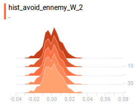

### 01_first_interresting_save : 15/04/2018

#### 15/04/2018 21h00

The agent was only doing one action (in general). But after 5000 episodes, the action distribution changed. Is it meaning that the agent is actually learning something but only changing after 5000 episodes? 

##### Action distribution

:


##### Hyperparameters

```python
# create the world
world_config = {
    'ennemies' : True
}

# create the neural network that will learn to avoid ennemies
avoid_ennemy_model = Model(session, 'avoid_ennemy', State.get_ennemy_agent_layer_shape(world), 1e-2,
    [[64, 'relu'],
    [32, 'relu'],
    [Action.NB_POSSIBLE_ACTIONS, 'linear']]
)
def avoid_ennemy_input_adapter(bus, next_state=False):
    if next_state:
        return bus['next_state'].get_ennemy_agent_layer_only()
    else:
        return bus['state'].get_ennemy_agent_layer_only()
avoid_ennemy_network = Network(
    avoid_ennemy_model,
    avoid_ennemy_input_adapter,
    True,
    True
)

# create agent and his hyperparameters (config)
epsilon = Epsilon(0.05)
def update_epsilon(epsilon):
    epsilon.value = epsilon.value
epsilon.set_epsilon_function(update_epsilon)

agent_config = {}
agent_config['epsilon'] = epsilon
agent_config['networks'] = [avoid_ennemy_network]
agent_config['output_network'] = avoid_ennemy_network
agent_config['copy_target_period'] = 100
agent_config['min_experience_size'] = 1000
agent_config['max_experience_size'] = 5000
agent_config['batch_size'] = 256
agent_config['gamma'] = 0.9

agent_config['save_folder'] = SAVE_FOLDER
agent_config['save_prefix_names'] = PREFIX_FILES_NAME
```


### 02_weights_distribution_strange_on_import (18/04/2018)

It seems that the weight distributions are slightly different after an export / import. Here are the weights distribution printed every 10 episodes. (We train a new agent for 50 episodes, then save it. ) Then, we import the same agent and retrain it for 50 episodes. 

on export: 


on import: 


on export: 


on import: 


on export: 



on import: 


Moreover, the agent doesnt train seems to train after having 15 20 episodes, so the weights should be the same after export / import. (I should be sure of that too...)

I should test more precicely that the agent is really gaining the same weights. (not only in the model test, which the export/import looks good.)

Maybe I do the histogram in the wrong time? 

If found this for W2: what doest this mean? Does if mean a drasting change? It would explain the drastic change.. ​:laughing:​


#### 18/04/2018 23h10

It turns out that the agent is trained a lot every episode, **AND the agent doesnt write his histogram on the very end of its training**  So this can explain the changes in the weights; the agent prints his histogram at the very begining, but not at the very end.  

```bash
random seed: -0.202106
episode 0
weights histograms printed
episode 1
episode 2
episode 3
episode 4
episode 5
episode 6
```

```bash
Network trained
weights histograms printed
episode 41
Network trained
Network trained
[...]
episode 49
Network trained
Network trained
[...]
Network trained
Network trained
Network trained
Network trained
Nb max episodes reached. Stop learning
Saving mainfile in save folder...
Saving networks models as ../tmp_saves/avoid_ennemy_trainer/my_test_folder/ ...
Saving done.
```

**this raises another problem and a possible anwer to the action distribution problem: ** the agent is training to much on the same experiences (since they are only removed one by one once the experience buffer is full). I should try remove every experience used by the agent to train. It would maybe correct the agent distribution problem defined on the chapter "01_first_interresting_save : 15/04/2018"

So the question is: should I remove every experience "consumed"? Or should I wait a lot between every training? I want to try to remove every experience "consumed", but I fear it wouldn't change the homogeneity of the training set. I have to thing about-it