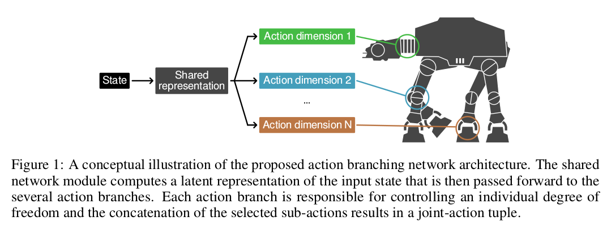

# Action Branching Architectures for Deep Reinforcement Learning

### Introduction

- Problem: the number of actions that need to be explicitly represented grows exponentially with increasing action dimensionality
- This method Branching Dueling Q-Network  (BDQ) can solve problems whos action space is up to $6.5*10^{25}$ actions tuples.
- They compare BDQ with an Independent Dueling Q-Network (with no shared parameters among the networks). IDQ quickly deteriorates whith increasing action dimensionality. This implies the inability of the agent to coordinate the independent action decisions across its several networks. (with IDQ).

### The Action Branching Architecture

- The architecture distributes the representation of the value function or the policy across several network branches while keeping a shared decision module among them to encode a latent representation of the common input state. 

